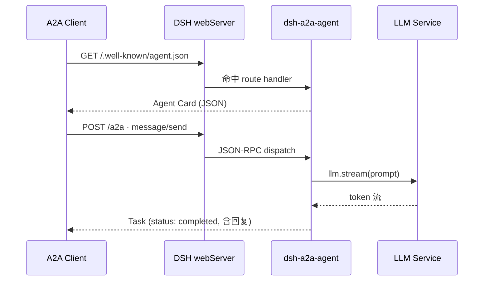

<div align="center">

# 🤝 DSH A2A Agent

**让任意 [DeepSeek Harness](https://github.com/deepseek-ai/deepseek-harness) 智能体一键成为 [A2A](https://a2a-protocol.org/) 兼容的 Agent**

一个轻量的 Cordis 插件：自带 **Agent Card** 发现、**JSON-RPC 2.0** 端点，以及**由大模型驱动**的对话回复。

<p>
  <a href="https://github.com/fangweixuan26-hash/dsh-a2a-agent/blob/main/LICENSE"></a>
  <a href="https://a2a-protocol.org/"></a>
  <a href="https://nodejs.org/"></a>
  <a href="https://github.com/fangweixuan26-hash/dsh-a2a-agent/stargazers"></a>
</p>

<p><i>Agent-to-Agent · 让智能体之间说同一种语言</i></p>

</div>

---

## ✨ 为什么你需要它

[A2A（Agent2Agent）](https://a2a-protocol.org/) 是 Google 于 2025 年推出的开放协议，让不同厂商、不同框架的智能体能够**互相发现、协作、对话**。而 DeepSeek Harness 原生只支持 MCP（Agent ↔ 工具），缺少对外暴露的 Agent 端点。

这个插件填补了空白 —— 一行配置，你的 DSH 智能体就有了标准化的 A2A 身份。

## 🚀 特性

<table>
  <tr>
    <td>🪪 <b>Agent Card 自动发现</b><br/>符合 A2A 1.0 规范的 <code>/.well-known/agent.json</code></td>
    <td>🔌 <b>JSON-RPC 2.0</b><br/>标准 <code>message/send</code> · <code>tasks/get</code> · <code>tasks/cancel</code></td>
  </tr>
  <tr>
    <td>🧠 <b>真实大模型回复</b><br/>复用宿主 <code>llm</code> 服务流式生成</td>
    <td>🛡️ <b>优雅降级</b><br/>模型不可用时自动回退确定性 echo</td>
  </tr>
  <tr>
    <td>🔀 <b>零端口冲突</b><br/>复用宿主 <code>webServer</code>，不抢端口</td>
    <td>♻️ <b>可逆生命周期</b><br/>所有副作用挂载在 Cordis fiber 上</td>
  </tr>
  <tr>
    <td>🌐 <b>CORS 开箱即用</b><br/>浏览器端 A2A 客户端可直接调用</td>
    <td>📦 <b>零运行时依赖</b><br/>所需服务全部由 DSH 宿主提供</td>
  </tr>
</table>

## 🧭 工作原理



## 📦 快速开始

### 前置条件

- 一个运行中的 **DeepSeek Harness**（提供 `webServer`、`llm`、`agentDefaultModel` 服务）
- Node.js ≥ 20

### 1. 安装

```bash
cd ~/.dsh/profiles/web   # 你的 DSH profile 目录
pnpm add dsh-a2a-agent   # 或 npm install dsh-a2a-agent
```

### 2. 挂载到宿主组合

在你的宿主组合（`cordis.yml` / `cordis.patch.yml`）中加入一行：

```yaml
- id: a2a-agent
  name: dsh-a2a-agent
```

> 💡 插件复用宿主的 `webServer`，因此必须挂载在能解析到该服务的 **host 平面**。

### 3. 验证

重启 harness 后：

```bash
curl http://127.0.0.1:3080/.well-known/agent.json
```

看到 Agent Card JSON 即说明挂载成功。

## 🔌 API 参考

### HTTP 端点

| 方法 | 路径 | 说明 |
|------|------|------|
| `GET` | `/.well-known/agent.json` | A2A 1.0 Agent Card |
| `GET` | `/.well-known/agent-card.json` | 旧版（0.2.x）别名，兼容 |
| `POST` | `/a2a` | JSON-RPC 2.0 入口 |

### JSON-RPC 方法

| 方法 | 参数 | 返回 | 说明 |
|------|------|------|------|
| `message/send` | `{ message }` | `Task` | 发送消息，同步生成回复并完成 |
| `tasks/get` | `{ id }` | `Task` | 按 id 查询任务 |
| `tasks/cancel` | `{ id }` | `Task` | 取消进行中的任务 |

### 错误码

| Code | 含义 |
|------|------|
| `-32700` | JSON 解析错误 |
| `-32600` | 非法请求 |
| `-32601` | 方法不存在 |
| `-32602` | 参数错误 |
| `-32001` | 任务不存在 |
| `-32603` | 内部错误 |

## 📡 使用示例

### 发送一条消息

```bash
curl -s http://127.0.0.1:3080/a2a \
  -H 'Content-Type: application/json' \
  -d '{
    "jsonrpc": "2.0",
    "id": 1,
    "method": "message/send",
    "params": {
      "message": {
        "messageId": "m1",
        "role": "user",
        "parts": [{ "kind": "text", "text": "用一句话介绍你自己" }]
      }
    }
  }'
```

返回（节选）：

```json
{
  "jsonrpc": "2.0",
  "id": 1,
  "result": {
    "id": "task-mss78xt9-2-4jyehv",
    "status": "completed",
    "artifacts": [
      {
        "artifactId": "art-...",
        "name": "reply",
        "parts": [{ "kind": "text", "text": "我是一个基于A2A协议的多功能AI助手…" }]
      }
    ]
  }
}
```

### 查询任务

```bash
curl -s http://127.0.0.1:3080/a2a \
  -H 'Content-Type: application/json' \
  -d '{"jsonrpc":"2.0","id":2,"method":"tasks/get","params":{"id":"task-mss78xt9-2-4jyehv"}}'
```

## 🧠 回复是如何生成的

1. 从 `message.parts` 提取所有 `text` 片段
2. 读取宿主 `agentDefaultModel` 的当前模型路由
3. 调用 `llm.stream()` 流式累积回复
4. 模型失败或不可用时，降级为 `[A2A echo]` 确定性回显

任务、消息、工件均存储于**进程内存**，插件停止时自动清空。

## ⚙️ 配置

当前版本无强制配置项。可选的扩展方向：

| 字段 | 说明 |
|------|------|
| `agentCard.name` | 自定义 Agent Card 名称 |
| `taskTtlMs` | 内存任务过期时间 |
| `systemPrompt` | 自定义模型系统提示词 |

## 🛣️ 路线图

- [ ] `message/stream` —— SSE 流式返回 token
- [ ] 子代理调度 —— 长任务转交 `subagents`
- [ ] 任务持久化 —— 跨插件重启保留
- [ ] 认证 —— Agent Card `securitySchemes` / Bearer token
- [ ] Client Run 卡片 —— 在对话流中展示端点状态

## 🤝 贡献

欢迎 Issue / PR！请先阅读 [A2A 规范](https://a2a-protocol.org/)。

## 📄 License

[MIT](./LICENSE) © [fangweixuan26-hash](https://github.com/fangweixuan26-hash)

---

<div align="center">
  <sub>Built with ❤️ for the DeepSeek Harness ecosystem</sub>
</div>
