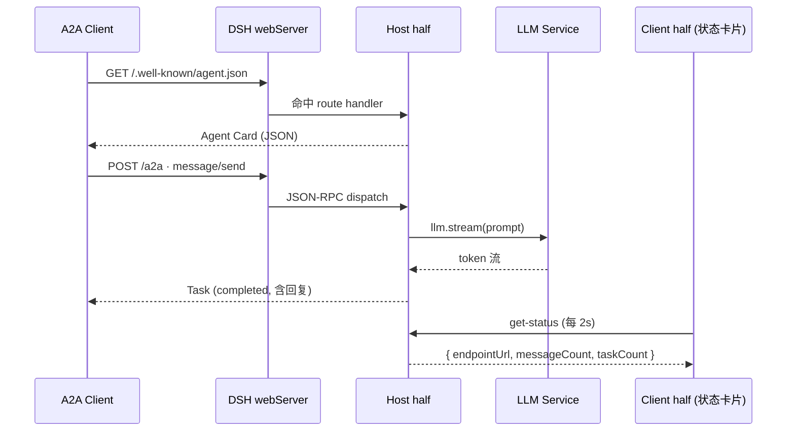

<div align="center">

# 🤝 DSH A2A Agent

**让任意 [DeepSeek Harness](https://github.com/deepseek-ai/deepseek-harness) 智能体一键成为 [A2A](https://a2a-protocol.org/) 兼容的 Agent**

一个轻量的 Cordis 插件：自带 **Agent Card** 发现、**JSON-RPC 2.0** 端点、**大模型驱动的对话回复**，以及一个**实时状态卡片**。

<p>
  <a href="https://github.com/fangweixuan26-hash/dsh-a2a-agent/blob/main/LICENSE"></a>
  <a href="https://a2a-protocol.org/"></a>
  <a href="https://nodejs.org/"></a>
  
  <a href="https://github.com/fangweixuan26-hash/dsh-a2a-agent/stargazers"></a>
</p>

<p><i>Agent-to-Agent · 让智能体之间说同一种语言</i></p>

</div>

---

## ✨ 为什么你需要它

[A2A（Agent2Agent）](https://a2a-protocol.org/) 是 Google 于 2025 年推出的开放协议，让不同厂商、不同框架的智能体能够**互相发现、协作、对话**。而 DeepSeek Harness 原生只支持 MCP（Agent ↔ 工具），缺少对外暴露的 Agent 端点。

这个插件填补了空白 —— 一次定义，你的 DSH 智能体就有了标准化的 A2A 身份，并在对话流里实时看到它的运行状态。

## 🚀 特性

<table>
  <tr>
    <td>🪪 <b>Agent Card 自动发现</b><br/>符合 A2A 1.0 规范的 <code>/.well-known/agent.json</code></td>
    <td>🔌 <b>JSON-RPC 2.0</b><br/>标准 <code>message/send</code> · <code>tasks/get</code> · <code>tasks/cancel</code></td>
  </tr>
  <tr>
    <td>🧠 <b>真实大模型回复</b><br/>复用宿主 <code>llm</code> 服务流式生成</td>
    <td>🛡️ <b>优雅降级</b><br/>模型不可用时自动回退确定性 echo</td>
  </tr>
  <tr>
    <td>📊 <b>实时状态卡片</b><br/>Run 卡片内展示端点 URL、消息数、任务数</td>
    <td>🔀 <b>零端口冲突</b><br/>复用宿主 <code>webServer</code>，不抢端口</td>
  </tr>
  <tr>
    <td>♻️ <b>可逆生命周期</b><br/>所有副作用挂载在 Cordis fiber 上</td>
    <td>🌐 <b>CORS 开箱即用</b><br/>浏览器端 A2A 客户端可直接调用</td>
  </tr>
</table>

## 🧭 工作原理



## 📁 文件结构

```
dsh-a2a-agent/
├── lib/index.js   # npm 包形态（Host 插件，可挂载到 host 组合）
├── host.js        # 动态插件 Host half → cordis_define 的 code.host
├── client.js      # 动态插件 Client half → cordis_define 的 code.client
├── README.md
├── LICENSE
├── package.json
└── cordis.example.yml   # 用法说明
```

## 🧩 两种形态

本项目同时提供两种形态，按需选用：

| 形态 | 文件 | 状态卡片 | 适用场景 |
|------|------|---------|---------|
| **npm 包** | `lib/index.js` | 通过 `/a2a/status` HTTP 端点轮询 | 挂载到宿主组合，`pnpm add dsh-a2a-agent` |
| **动态插件** | `host.js` + `client.js` | 内置 Run 卡片（每 2s 轮询） | `cordis_define` 即时加载，零构建 |

> 💡 为什么 npm 包形态不带内置 Client 卡片：DSH 正式插件的 Client→Host 通信走 **Typert Remote**（TS 装饰器 + 构建时生成 codec），需要完整构建链。为保持零构建、可直接挂载，npm 包形态用 `/a2a/status` HTTP 端点替代，任意前端都能轮询渲染。

## 📦 快速开始

### 方式 A：npm 包形态（挂载宿主组合）

```bash
cd ~/.dsh/profiles/web
pnpm add dsh-a2a-agent
```

在宿主组合（`cordis.yml` / `cordis.patch.yml`）加入：

```yaml
- id: a2a-agent
  name: dsh-a2a-agent
```

重启后验证：

```bash
curl http://127.0.0.1:3080/.well-known/agent.json   # Agent Card
curl http://127.0.0.1:3080/a2a/status               # 状态 JSON
```

### 方式 B：动态插件形态（含状态卡片）

把 `host.js` / `client.js` 的内容作为动态插件的两个 half：

```js
cordis_define(
  { plugin: { kind: "new", idPrefix: "bridge" } },
  name: "A2A Protocol Server",
  purpose: "Expose this agent over A2A",
  code: { host, client },  // host = host.js 内容, client = client.js 内容
)
cordis_run(...)
```

> 💡 首次运行含 Client 代码的 Package 需要你在 UI 里**批准**；批准后 Run 卡片内会出现状态卡片。

## 🔌 API 参考

### HTTP 端点

| 方法 | 路径 | 说明 |
|------|------|------|
| `GET` | `/.well-known/agent.json` | A2A 1.0 Agent Card |
| `GET` | `/.well-known/agent-card.json` | 旧版（0.2.x）别名，兼容 |
| `POST` | `/a2a` | JSON-RPC 2.0 入口 |
| `GET` | `/a2a/status` | 状态 JSON（端点 URL、消息数、任务数） |

### JSON-RPC 方法

| 方法 | 参数 | 返回 | 说明 |
|------|------|------|------|
| `message/send` | `{ message }` | `Task` | 发送消息，同步生成回复并完成 |
| `tasks/get` | `{ id }` | `Task` | 按 id 查询任务 |
| `tasks/cancel` | `{ id }` | `Task` | 取消进行中的任务 |

### 错误码

| Code | 含义 |
|------|------|
| `-32700` | JSON 解析错误 |
| `-32600` | 非法请求 |
| `-32601` | 方法不存在 |
| `-32602` | 参数错误 |
| `-32001` | 任务不存在 |
| `-32603` | 内部错误 |

## 📡 使用示例

### 发送一条消息

```bash
curl -s http://127.0.0.1:3080/a2a \
  -H 'Content-Type: application/json' \
  -d '{
    "jsonrpc": "2.0",
    "id": 1,
    "method": "message/send",
    "params": {
      "message": {
        "messageId": "m1",
        "role": "user",
        "parts": [{ "kind": "text", "text": "用一句话介绍你自己" }]
      }
    }
  }'
```

返回（节选）：

```json
{
  "jsonrpc": "2.0",
  "id": 1,
  "result": {
    "id": "task-...",
    "status": "completed",
    "artifacts": [
      { "artifactId": "art-...", "name": "reply",
        "parts": [{ "kind": "text", "text": "我是一个基于A2A协议的多功能AI助手…" }] }
    ]
  }
}
```

### 查询任务

```bash
curl -s http://127.0.0.1:3080/a2a \
  -H 'Content-Type: application/json' \
  -d '{"jsonrpc":"2.0","id":2,"method":"tasks/get","params":{"id":"task-..."}}'
```

## 🧠 回复是如何生成的

1. 从 `message.parts` 提取所有 `text` 片段
2. 读取宿主 `agentDefaultModel` 的当前模型路由
3. 调用 `llm.stream()` 流式累积回复
4. 模型失败或不可用时，降级为 `[A2A echo]` 确定性回显

任务、消息、工件均存储于**进程内存**，插件停止时自动清空。

## 🛣️ 路线图

- [x] npm 包形态 —— 作为 host 组合条目挂载（含 `/a2a/status` 端点）
- [ ] `message/stream` —— SSE 流式返回 token
- [ ] 子代理调度 —— 长任务转交 `subagents`
- [ ] 任务持久化 —— 跨插件重启保留
- [ ] 认证 —— Agent Card `securitySchemes` / Bearer token
- [ ] npm 包 Client 卡片 —— 走 Typert Remote（需 DSH 构建链）

## 🤝 贡献

欢迎 Issue / PR！请先阅读 [A2A 规范](https://a2a-protocol.org/)。

## 📄 License

[MIT](./LICENSE) © [fangweixuan26-hash](https://github.com/fangweixuan26-hash)

---

<div align="center">
  <sub>Built with ❤️ for the DeepSeek Harness ecosystem</sub>
</div>
